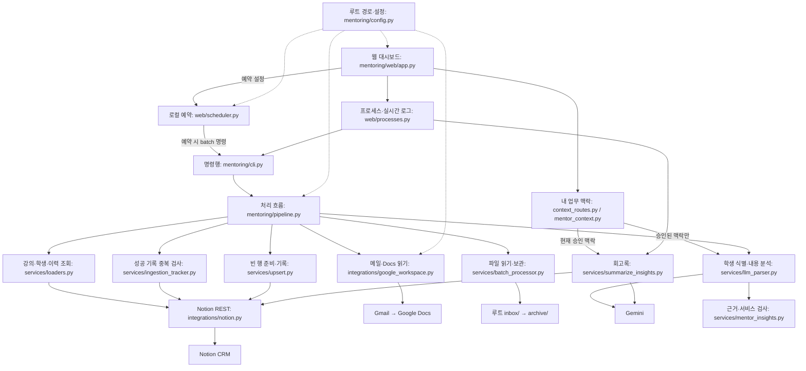

# 멘토링 CRM 시스템 구조도

현재 Python 모듈과 외부 서비스의 연결입니다. 다이어그램의 모듈들은 독립 실행 AI 에이전트가 아니라
하나의 프로그램에서 호출하는 Python 코드입니다. 파일 위치는 `project_structure.md`를 참고하세요.

## 실행과 데이터 흐름

1. 진행 중인 강의를 조회합니다. 없으면 기존 로직에 따라 종료일 내림차순의 첫 강의를 가져옵니다.
2. 강의 내부 DB와 학생을 찾고, 설정된 과제·멘토링 수만큼 학생별 빈 행을 준비합니다.
3. auto는 Gmail 제목 키워드로 Google Docs를 수집합니다. batch는 `inbox/`의 `.txt`·`.md`를 읽습니다.
   direct는 웹 입력을 임시 JSON 파일로 받아 처리합니다. CLI에는 `--payload`로 전달합니다.
4. 성공 처리 이력으로 중복을 확인하고, Gemini로 학생·강의를 식별합니다.
5. 학생별 내용을 분석하여 멘토링, 학생 프로필, 과제 주제, 멘토 인사이트에 반영합니다.
6. 세션은 비어 있는 행을 사용하거나 새 행을 만들고 날짜 순으로 제목을 다시 정합니다.
7. 처리 이력을 기록합니다. batch는 처리 함수 반환 후 파일을 `archive/`로 이동하려고 시도합니다.

웹 직접 입력에는 여러 학생의 텍스트를 먼저 분리하고 검토하는 기능이 있습니다.
자동 수집에서 여러 학생이 감지되거나 매칭에 실패하면 검토 큐에 보냅니다.
멘토 인사이트는 대화 근거·업무 적용 가설을 구분하고 기존 Summary 속성에 상세 내용을 저장합니다.
업무 맥락의 등록·승인과 인사이트 단계는 `mentor_insights.md`를 참고하세요.
회고록 생성은 모든 인사이트 분류를 읽는 별도 명령이며, 웹에서는 기존 로직대로 조회된 첫 강의를 사용합니다.

## 예약과 프로세스

- `web/app.py`: HTTP 요청과 화면 제공
- `web/processes.py`: `sys.executable -m ...` 명령 구성, 루트 cwd 지정, 로그 스트리밍
- `web/scheduler.py`: 루트 `automation_config.json` 저장·조회, batch 예약 실행
- 대시보드 시작 함수에서 예약 스레드 한 개를 시작합니다. import만으로는 예약하지 않습니다.
- 서버는 `127.0.0.1:5000`에서 실행하고 자동 재시작 기능은 끕니다.
- 예약은 프로그램이 켜져 있을 때만 동작하며 Gmail auto 모드 예약은 아닙니다.

## 설정과 문서

코드의 위치가 바뀌어도 인증·입력 파일 위치는 바뀌지 않습니다.
`mentoring/config.py`의 `PROJECT_ROOT`가 프로젝트 위치를 계산합니다.
웹은 이 루트를 기준으로 `docs/`를 읽고, 패키지 내부 `web/templates/`, `web/static/`을 제공합니다.

Gmail 읽음 상태와 처리 이력은 다릅니다. 현재 수집은 읽지 않은 메일만으로 제한되지 않으며,
Notion의 Success 이력으로 재처리를 방지합니다. 실패·검토 큐 처리와 원문 길이 제한 등은
`known_limitations.md`에 별도로 기록했습니다. 기존 문제를 구조 정리 과정에서 임의로 숨기지 않습니다.
