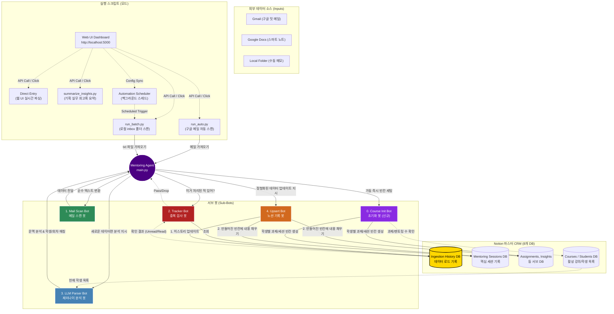

# 멘토링 CRM 시스템 구조도 (Architecture Diagram)

전체 시스템을 하나의 **'Mentoring Agent(메인 관제탑)'**라고 했을 때, 그 아래에서 특정 역할만 수행하는 **서브 봇(Sub-Bots)**들이 유기적으로 통신하며 작동하는 구조입니다.

### 실행 모드 (Entry Points)
세 가지 파이썬 스크립트 중 상황에 맞는 것을 더블클릭하거나 **Web UI Dashboard (http://localhost:5000)** 를 통해 실행하여 파이프라인(main.py)을 가동합니다.
- **`run_auto.py` (자동 메일 모드)**: 구글 메일을 스캔하여 들어온 회의록을 모두 처리합니다. (기본 봇)
- **`run_batch.py` (수동 로컬 모드)**: 구글 스캔은 건너뛰고, 오류 보관함에서 수동으로 쪼갠 뒤 `inbox/` 폴더에 넣은 `.txt` 파일들만 일괄 처리합니다. 처리가 끝난 파일은 `archive/` 폴더로 자동 이동됩니다.
- **`Direct Entry` (직접 입력 모드)**: 웹 UI에서 복붙한 텍스트를 실시간으로 파싱하고, Step 1(추출)과 Step 2(검토/삭제)를 거쳐 정확한 데이터만 노션에 즉시 반영하는 대화형 기능입니다.
- **`Automation Schedule` (스케줄러 모드 - 신규!)**: `app.py` 내의 백그라운드 스레드로 동작하며, 사용자가 UI에서 지정한 주기(Daily/Weekly)와 시간에 맞춰 자동으로 `run_batch.py` 등을 실행해 주는 오토파일럿 기능입니다.
- **`summarize_insights.py` (회고록 요약 모드)**: 강의가 끝났을 때 멘토 인사이트를 모아 제미나이에게 '기획 실무 회고록 리포트' 작성을 지시합니다.

### 서브 봇 역할 요약
0. **Course Init Bot (초기화 봇 - 신규!):** 파이프라인이 가동되면 가장 먼저 뛰어가는 봇입니다. 강의 일정 DB에 적힌 '과제 수'와 '멘토링 수'를 보고, 각 학생별로 과제 제출함과 멘토링 회의록의 **빈칸(뼈대)을 미리 쫙 만들어둡니다.**
1. **Mail Scan Bot (메일 스캔 봇):** `run_auto.py`가 물어온 구글 문서 링크(Docs)나 메일을 분석에 적합한 순수한 텍스트 데이터로 변환해 주는 전처리 역할을 합니다. 기존 로컬 폴더 스캔 기능은 수동 모드로 분리되었거나 제외되었습니다.
2. **Tracker Bot (중복 검사 봇):** 8번째 DB(History)를 감시하는 문지기입니다. 이미 처리한 메일이나 파일이 파이프라인에 다시 들어오지 못하게 차단합니다.
3. **LLM Parser Bot (분석 봇):** 제미나이(Gemini 2.5 Pro)의 '뇌'입니다. 학생 목록 DB를 보고 회의록의 주인공과 몇 회차 세션인지 추론한 뒤 데이터를 예쁘게 분리해 줍니다.
4. **Upsert Bot (기록 봇):** 노션 API라는 '손'입니다. 이제 무작정 새 페이지를 만들지 않고, **0번 봇이 만들어둔 빈칸(해당 회차)을 정확히 찾아가서** 제미나이가 요약한 내용을 쏙쏙 채워 넣습니다(Update).

---

## ⚠️ 예외 및 오류 대처 정책 (Exception Handling Policy)

파이프라인이 중단되거나 데이터가 누락되는 등의 주요 예외 케이스와 대처 방안입니다.

### 1. 구글 인증 토큰 만료 (`invalid_grant`)
- **증상**: 구글 메일 스캔 시 `Token has been expired or revoked.` 에러가 출력되며 진행이 멈춤.
- **원인**: 구글 클라우드에서 발급받은 테스트용 토큰은 보안상 주기적으로(약 7일) 만료 처리됨.
- **대처 방안 (갱신 프로세스)**:
  1. 프로젝트 폴더 내에 생성되어 있는 `token.json` 파일을 찾아 직접 삭제합니다.
  2. 스크립트(`run_auto.py`)를 재실행하면 자동으로 브라우저가 열리며 구글 로그인 창이 뜹니다.
  3. 구글 계정으로 로그인하여 권한을 다시 허용해 주면 새 토큰이 발급되어 즉시 정상 작동합니다.

### 2. Global Review Queue (오류 보관함) 회부 케이스
데이터 스캔은 정상적으로 성공했으나, **사람의 개입(확인 및 수동 처리)**이 필요하다고 판단된 경우 봇이 저장을 멈추고 원문과 사유를 오류 보관함으로 보냅니다. (이곳으로 넘어간 메일은 `Ingestion History`에서 기록을 삭제해야만 나중에 다시 스캔됩니다.)
- **케이스 A. 매칭 실패 (학생/강의 모름)**: 제미나이가 원문을 읽어도 학생 DB에서 일치하는 사람이나 강의를 찾지 못한 경우.
- **케이스 B. 섞인 회의록 감지 (다수 학생)**: 하나의 메일 안에 여러 학생(예: 김채원, 이도건)의 내용이 섞여 있는 것을 봇이 감지한 경우. (임의로 한 명에게 몰아주지 않고 거부함. 👉 **텍스트를 학생별로 잘라 수동 배치(`--mode batch`)로 개별 업로드**하거나 애초에 분리해서 메일을 보내야 함)

### 3. 수집 범위를 벗어난 오래된 메일 누락
- **증상**: 기존 데이터를 지우고 처음부터 다시 돌렸는데, 너무 예전 메일들은 스캔 대상에서 제외됨.
- **원인**: Gmail API가 1회 호출 시 가장 최근의 메일 N개(`maxResults`)까지만 가져오도록 제한되어 있기 때문.
- **대처 방안**:
  - `google_api_client.py` 내부의 `maxResults` 값을 최대 500 등 넉넉하게 세팅하여 과거 메일까지 도달하도록 합니다.
  - 그래도 닿지 않는 너무 오래된 데이터나 구글 메일이 아닌 외부 자료라면, 텍스트 파일로 저장해 `inbox/` 폴더에 넣고 수동 모드(`--mode batch`)로 실행해 강제로 밀어넣습니다.

### 4. 400 Error 등 노션 API 통신 에러
- **증상**: 터미널에 `400 Error`나 `Validation Error`가 뜨며 노션에 데이터가 들어가지 않음. 해당 건은 오류 보관함(Review Queue)에도 없음.
- **원인**: 텍스트가 노션의 블록 글자수 제한(2000자)을 초과했거나, 잘못된 특수문자 포맷 등으로 인해 노션 서버가 저장을 거부한 경우. API 통신 중 발생한 시스템 에러는 보관함이 아닌 `Ingestion History` DB에 'Error' 상태로 기록됩니다.
- **대처 방안**:
  - `Ingestion History` DB를 확인하여 Error 상태인 메일을 찾고 삭제합니다.
  - 코드 상에서 글자수 제한(`[:2000]`)이 제대로 적용되어 있는지 확인하거나, 원문 텍스트의 깨진 문자를 수정한 후 재실행합니다.

