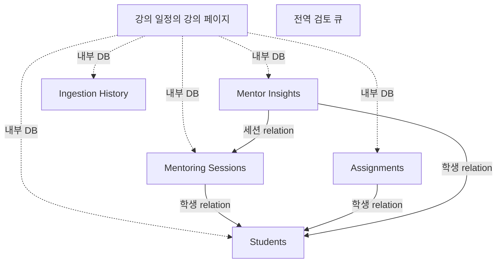

# 마스터 CRM 노션 DB 스키마 및 관계형(Relation) 설정 가이드

강사님께서 파이프라인의 100% 성능을 끌어내실 수 있도록, 봇이 코드로 접근하는 **필수 DB 속성(Properties)**과 **추천 관계형(Relation)** 세팅을 정리해 드립니다. 

---

## 🌐 최상위 글로벌 DB (Global Databases)
강의별로 흩어져 있지 않고, 워크스페이스에 단 하나씩만 존재하는 핵심 데이터베이스입니다.

### 1. 📅 강의 일정 (Courses)
파이프라인이 어떤 강의가 진행 중인지 판단하고, 이메일에서 어떤 키워드로 메일을 긁어올지 결정하는 최상위 DB입니다.

| 필드명 (속성 이름) | 속성 유형 (Type) | 포맷팅 (Format) | 설명 (Description) | 비고 (Remarks) |
| :--- | :--- | :--- | :--- | :--- |
| **강의명** | `제목 (Title)` | - | 강의의 공식 명칭 (예: 서비스기획 부트캠프) | |
| **시작일** | `날짜 (Date)` | - | 강의 시작일 | 봇이 이 날짜를 기준으로 활성 강의를 찾습니다 |
| **종료일** | `날짜 (Date)` | - | 강의 종료일 | 봇이 이 날짜를 기준으로 활성 강의를 찾습니다 |
| **강의 대상** | `텍스트 (Text)` | - | 강의를 듣는 대상 | 봇 동작에 영향 없음 |
| **강의 위치** | `텍스트 (Text)` | - | 강의가 진행되는 장소 | 봇 동작에 영향 없음 |
| **메일 자동화 검색 키워드** | `텍스트 (Text)` | - | 이 강의의 회의록을 구글 메일에서 찾을 때 쓸 검색어 | (예: "회의록", "Zoom 메모") |
| **과제 여부** | `체크박스 (Checkbox)` | - | 과제가 포함된 강의인지 여부 | 봇이 이 체크박스를 확인합니다 |
| **과제 수** | `숫자 (Number)` | - | 과제 총 개수 | 봇이 이 개수만큼 학생별 과제 제출칸(행)을 생성합니다 |
| **1:1 멘토링 여부** | `체크박스 (Checkbox)` | - | 1:1 멘토링 포함 여부 | 봇이 이 체크박스를 확인합니다 |
| **1:1 멘토링 수** | `숫자 (Number)` | - | 예정된 총 멘토링 횟수 | 봇이 이 개수만큼 학생별 멘토링 회의록 빈칸(행)을 생성합니다 |

### 2. 🚨 Email Analysis Error Queue (통합 에러 보관함)
어느 강의/학생인지 매칭하지 못한 입력 등을 보관하는 전역 검토 큐입니다. 아래 피드백 필드는 과거 복구 구현을 위한 항목도 포함합니다. `legacy/error_recovery.py`는 현재 자동 실행 흐름에 연결되어 있지 않습니다. 낮은 확신도는 현재 코드에서 강의별 ReviewQueue로 전달합니다.

| 필드명 (속성 이름) | 속성 유형 (Type) | 포맷팅 (Format) | 설명 (Description) |
| :--- | :--- | :--- | :--- |
| **Mail Title** | `제목 (Title)` | - | 에러가 발생한 원본 메일 제목 |
| **Error Reason** | `텍스트 (Text)` | - | 에러 사유 (예: `매칭 실패`, `확신도 낮음`) |
| **Date** | `날짜 (Date)` | - | 에러 발생 일시 |
| **Raw Email Text** | `텍스트 (Text)` | - | 원본 텍스트 앞부분 최대 2,000자 (현재 코드 제한) |
| **Human Feedback** | `텍스트 (Text)` | - | 강사님이 봇에게 알려주는 힌트 (예: "이거 최소연 꺼야", "이건 2차 멘토링임") |
| **Resolved Studnet Name** | `텍스트 (Text)` | - | 매칭된 학생 이름을 수동 기재할 때 사용하는 보조 텍스트 칸 |
| **Error Fix Trial** | `체크박스 (Checkbox)` | - | 봇이 이 피드백을 기반으로 재시도(복구)를 수행했는지 여부 표시 |

---

## 📚 코스 내부 DB (Master CRM Template 내부)
이 DB들은 최상위 **'강의 일정' DB의 각 행(예: 서비스기획 부트캠프)을 클릭해서 페이지로 열었을 때, 그 페이지 내부**에 위치해야 합니다. 
새로운 강의가 시작될 때마다 '마스터 템플릿'에서 복사되어 각 강의 페이지 안으로 들어가는 핵심 CRM DB들입니다.

### 3. 🧑‍🎓 학생 CRM (Students)
각 과정의 수강생 명단을 관리하고, 각 학생의 전반적인 프로필과 상태를 한눈에 볼 수 있는 곳입니다.

| 필드명 (속성 이름) | 속성 유형 (Type) | 포맷팅 (Format) | 설명 (Description) | 비고 (Remarks) |
| :--- | :--- | :--- | :--- | :--- |
| **Student Name** | `제목 (Title)` | - | 학생의 이름 | 봇이 학생을 매칭할 때 사용합니다 |
| **Alias** | `텍스트 (Text)` | - | 봇이 스스로 학습한 학생의 영어 닉네임이나 오타 | 봇이 매칭 확률을 높이기 위해 참조합니다 |
| **Background** | `텍스트 (Text)` | `- [카테고리]: [내용]` 형태의 불릿 포인트 | 전공, 경험, 목표 등 학생의 백그라운드 | 봇이 회의록을 읽고 **자동 업데이트**합니다. • 표준 카테고리: `현재 직업`, `본전공`, `복수전공`, `과거 이력 및 경험`, `서비스기획에 대한 관심도 및 목표` • 회의록에 언급되지 않은 항목은 생략됨 • 그 외 특징은 카테고리명 없이 내용만 기재됨 |
| **Status** | `선택 (Select)` | 정해진 4개 옵션 중 택 1 | 학생의 현재 수강 상태 | 봇이 회의록을 읽고 **자동 업데이트**합니다 (`🟢 정상 진행`, `🟡 과제 지연`, `🔴 이탈 위험`, `⭐ 우수 수강생`) |
| **멘토링 기록** | `관계형 (Relation)` | - | ➡️ `Mentoring Sessions` DB와 연결 | 봇이 새로운 멘토링 세션을 등록할 때 이 학생 페이지에 자동으로 연결해 줍니다 |
| **과제 기록** | `관계형 (Relation)` | - | ➡️ `Assignments` DB와 연결 | 봇이 새로운 과제 빈칸을 만들 때 이 학생 페이지에 자동으로 연결해 줍니다 |

### 4. 💬 Mentoring Sessions (멘토링 회의록)
봇이 분석한 멘토링 요약본이 쌓이는 곳입니다. 학생 DB와의 연결이 필수적입니다.

| 필드명 (속성 이름) | 속성 유형 (Type) | 포맷팅 (Format) | 설명 (Description) | 비고 (Remarks) |
| :--- | :--- | :--- | :--- | :--- |
| **Session Title** | `제목 (Title)` | `N차 멘토링` | 세션 제목 | 봇이 날짜 기준으로 오름차순으로 **자동 정렬(리네이밍)** 합니다 |
| **🧑‍🎓 Students (학생 CRM)** | `관계형 (Relation)` | - | `Students` DB와 연결 | 봇이 빈칸을 만들 때 학생을 자동으로 매핑합니다 |
| **Session Date** | `날짜 (Date)` | `YYYY-MM-DD` | 세션 진행일 | 회의록 메일의 날짜를 추출하여 **자동 기입**합니다 |
| **One Sentence** | `텍스트 (Text)` | 1~2문장 요약 | 전체 미팅 핵심 1줄 요약 | 봇이 `Meeting Summary` 내용을 압축하여 **자동 기입**합니다 |
| **Meeting Summary** | `텍스트 (Text)` | `- 내용` (블릿포인트) | 주요 논의 내용 | 봇이 회의록을 요약하여 **자동 기입**합니다 |
| **Student to-do** | `텍스트 (Text)` | `- 내용` (블릿포인트) | 학생 다음 과제/할 일 | 봇이 회의록의 Action Items를 추출해 **자동 기입**합니다 |
| **Raw Note** | `텍스트 (Text)` | 원문 그대로 | 원본 회의록 텍스트 | 봇이 파싱 전 이메일/회의록 원문을 **자동 기입**합니다 (2000자 제한) |

### 5. 📝 Assignments (과제 트래커)
과제 여부가 켜진 강의의 수강생별 과제 제출 현황이 기록됩니다. 봇이 자동으로 빈칸을 깔아주면, 마감일과 제출 파일만 수동으로 관리하시면 됩니다.

| 필드명 (속성 이름) | 속성 유형 (Type) | 포맷팅 (Format) | 설명 (Description) | 비고 (Remarks) |
| :--- | :--- | :--- | :--- | :--- |
| **Assignment Title** | `제목 (Title)` | `N차과제` 포맷 | 과제명 | 봇이 **자동 생성**합니다 |
| **🧑‍🎓 Students (학생 CRM)** | `관계형 (Relation)` | - | `Students` DB와 연결 | 봇이 빈칸을 만들 때 학생을 자동으로 매핑합니다 |
| **Subject** | `텍스트 (Text)` | - | 과제 주제 | 봇이 회의록에서 파악하여 학생의 모든 과제 행에 **자동 업데이트**합니다 (1, 2차 과제는 공동 목표이므로 최신 주제로 동기화) |
| **Due Date** | `날짜 (Date)` | - | 제출 기한 | (수동) 강사님이 세팅합니다 |
| **Status** | `선택 (Select)` | - | 제출 상태 | (수동) 강사님이 확인하고 변경합니다 |
| **File** | `파일과 미디어 (Files & media)` | - | 과제 제출물 | (수동) 학생이 낸 과제 파일/링크를 첨부합니다 |
| **비고** | `텍스트 (Text)` | - | 기록용 메모 | (수동) 강사님이 자유롭게 메모하는 칸입니다 |

### 6. 💡 Mentor Insights (강사 인사이트)
대화에서 멘토 본인의 AI 서비스 기획 업무에 재사용할 발견과 적용 가설을 기록하는 DB입니다. 학생 평가 반복을 피하고 대화 근거·적용 서비스·실험·판단 기준·한계를 기존 Summary에 함께 저장합니다. 새 DB 속성 추가는 필요하지 않습니다. 자세한 흐름은 `mentor_insights.md`를 참고하세요.

| 필드명 (속성 이름) | 속성 유형 (Type) | 포맷팅 (Format) | 설명 (Description) | 비고 (Remarks) |
| :--- | :--- | :--- | :--- | :--- |
| **Insight Title** | `제목 (Title)` | 1줄 텍스트 | 인사이트 제목 | 제미나이가 요약하여 핵심 키워드 1줄 제목으로 자동 생성합니다 |
| **Insight Type** | `선택 (Select)` | 정해진 4개 옵션 중 택 1 | 인사이트 유형 | 봇이 회의록 뉘앙스를 분석해 자동 분류합니다 (`기획 실무`, `교육 개선`, `학습 태도 및 동기`, `취업 및 진로 고민`) |
| **Summary** | `텍스트 (Text)` | `- 내용` 형태의 불릿 포인트 + 줄바꿈 | 상세 내용 요약 | 봇이 추출한 세부 인사이트 내용을 자동 기입합니다. |
| **🧑‍🎓 Students (학생 CRM)** | `관계형 (Relation)` | - | ➡️ `Students` DB와 연결 | 봇이 학생 페이지를 자동 연결합니다 |
| **💬 Mentoring Sessions** | `관계형 (Relation)` | - | ➡️ `Mentoring Sessions` DB와 연결 | 봇이 해당 멘토링 세션을 자동 연결합니다 |

### 7. 🕒 Ingestion History (데이터 수집 기록)
파이프라인이 어떤 메일을 처리했고, 어떤 걸 안 했는지 스스로 기억하는 장부입니다.

| 필드명 (속성 이름) | 속성 유형 (Type) | 포맷팅 (Format) | 설명 (Description) |
| :--- | :--- | :--- | :--- |
| **Source Title** | `제목 (Title)` | `[학생명] 원본메일제목` 포맷 | 이메일의 메일 제목 |
| **Source ID** | `텍스트 (Text)` | - | 이메일의 고유 메시지 ID (중복 방지용 숨은 값) |
| **Type** | `선택 (Select)` | - | 데이터 출처 (Email, Local File 등) |
| **Status** | `선택 (Select)` | - | 처리 상태 (Success, Review Required, Failed 등; 실제 기록 경로는 known_limitations.md 참고) |
| **Processed At** | `날짜 (Date)` | - | 파이프라인이 데이터를 수집한 시간 |

## 관계 개요

다음 그림에서 강의와 하위 DB의 연결은 페이지 내부 포함 관계이고,
학생·세션·과제·인사이트 사이의 연결은 Notion relation 속성입니다.

이 문서는 Notion의 필드 정의입니다. Python 폴더 구조는 `project_structure.md`, 처리 순서는
`architecture_diagram.md`가 기준입니다. 실제 연결된 Notion DB를 이번 구조 정리에서 변경하지 않았습니다.
