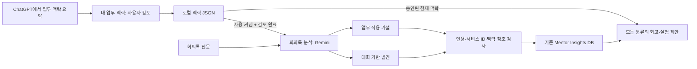

# 멘토 업무 맥락과 인사이트

이 도구에는 두 목적이 있습니다. 학생 CRM을 관리하고, 학생과의 대화에서 멘토 자신의
AI 서비스 기획 업무에 도움이 되는 발견과 새로운 적용 가설을 축적합니다.

## ChatGPT 기록 연결 방식

현재 버전은 개인 ChatGPT 대화·메모리를 자동 동기화하거나 로그인 정보를 수집하지 않습니다.
OpenAI의 [대화 상태 API 안내](https://developers.openai.com/api/docs/guides/conversation-state)는
앱이 전달한 대화 입력과 API의 대화 상태를 관리하는 방식입니다.
이번 확인에서는 개인 ChatGPT 기록·메모리를 이 앱으로 직접 읽어오는 공식 연동 방법을 확인하지 못했습니다.
따라서 전체 기록을 연결했다고 표시하지 않고, 필요한 업무 맥락을 선택적으로 옮깁니다.

1. 대시보드 상단 **내 업무 맥락**을 엽니다.
2. 내 역할과 현재 목표를 적고 담당 서비스별 이름·사용자·AI 기능·단계·문제·제약을 등록합니다.
3. 업무 대화를 나눈 ChatGPT에서 화면의 요청문으로 관련 맥락을 요약합니다.
4. 메모에 붙여넣거나 `.txt`·`.md`를 가져옵니다. 파일 읽기는 브라우저 안에서만 이뤄집니다.
5. 실제 사실, 최신 상태, 업무상 외부 전송 가능 여부를 검토합니다. 개인정보·키·기밀은 지웁니다.
6. 검토한 서비스/메모의 **현재 내용 확인 완료 · 분석 사용**을 체크합니다.
7. 전송 안내를 확인하고 전체 사용 설정을 켠 뒤 **맥락 저장**을 누릅니다.
8. 저장본 미리보기에서 다음 분석에 포함될 항목을 확인합니다.

내용을 수정하면 그 항목의 검토 체크가 해제됩니다. 재검토하고 체크한 뒤 저장하세요.
메모의 출처에는 대화명과 기준 날짜를 함께 적으면 오래된 맥락을 구분하기 쉽습니다.
서비스는 최대 8개, 메모는 최대 12개/각 12,000자, 전체 JSON은 50,000자 이내입니다.
전체 ChatGPT 내보내기 ZIP/JSON은 지원하지 않습니다. 필요한 업무 맥락만 요약해서 사용하세요.

## 저장과 전송

- 설정은 `runtime/mentor_context.json`에 저장됩니다. 기존 `/runtime/` Git 제외 정책에 해당합니다.
- 설정 읽기·저장·삭제는 Gemini나 Notion을 호출하지 않습니다.
- 기본 사용 설정은 꺼져 있습니다. 켜면 역할·목표 및 검토 완료 항목만 다음 분석 요청에 포함됩니다.
- 현재 분석 엔진은 **Google Gemini**입니다. GPT에서 정리한 내용도 이 엔진으로 전달됩니다.
- 생성 결과에는 서비스명·대화 근거·맥락 참조 ID가 포함되어 **Notion**에 저장될 수 있습니다.
- 삭제/사용 중지는 다음 요청부터 적용됩니다. 진행 중 요청과 기존 Notion 결과는 회수하지 않습니다.
- 원본 파일은 암호화하지 않은 로컬 JSON입니다. PC 접근 권한과 백업을 직접 관리하세요.
- 이 앱은 로컬 단일 사용자용입니다. 인증 없는 웹 서버를 외부 네트워크에 공개하지 마세요.
- 잘못된 파일은 자동 덮어쓰지 않습니다. 읽을 수 없으면 맥락 없이 분석하고 경고합니다.

## 인사이트 처리

단순한 학생 상태 평가를 반복하지 않고 멘토에게 재사용 가능한 발견을 최대 5개 추출합니다.
근거가 없으면 빈 배열이 정상입니다. 관찰과 가설을 구분하며, 회의록의 실제 인용을 요구합니다.
원문에 없는 인용, 승인 목록에 없는 서비스 ID나 맥락 ID, 실행/판단 기준이 없는 가설은 제외합니다.
적용 서비스가 없으면 일반 제안임을 명시합니다. 서비스명은 모델 출력 대신 등록한 이름으로 채웁니다.
인용 검사만으로 해석의 타당성이 보장되지는 않으므로 사람이 결과를 검토해야 합니다.

저장 형식: 구분 → 설명 → 대화 근거 → 적용 서비스 → 연결 이유 → 작은 실험 → 판단 기준 → 조건/미확인 사항 → 맥락 참조/버전.
Notion DB에 새 속성을 만들지 않고 기존 `Summary`에 저장하며 긴 내용은 여러 rich_text 조각으로 나눕니다.
학생·세션 relation은 기존대로 유지됩니다. 새 인사이트도 여전히 세션 생성과 CRM 매칭 성공에 의존합니다.

회고록은 기존 ‘기획 실무’ 필터를 없애고 ‘교육 개선’ 등을 포함한 모든 분류를 페이지 끝까지 조회합니다.
인사이트 근거 ID를 프롬프트에 전달하고 관찰/가설 구분, 실험/판단 기준, 원문 확인 필요 표시를 요청합니다.
조회한 전체 인사이트가 모델 컨텍스트를 넘을 정도로 많아지면 분할 요약이 추가로 필요합니다.

## 기존 데이터와 검증 범위

기존 인사이트는 그대로 읽습니다. 대화 인용이 없으면 회고록에서 원문 확인이 필요함을 표시하도록 지시합니다.
이미 성공 처리된 회의록은 중복 방지 때문에 새 방식으로 자동 재분석되지 않습니다.
기존 처리 이력을 지워 강제로 재처리하면 중복 기록이 생길 수 있으므로 이번 변경에서 자동 백필하지 않습니다.

오프라인 테스트는 맥락 승인/전송 제외, 저장 충돌, 입력 제한, 출처 검사, 기존 DB 호환,
페이지네이션, 프롬프트 전달을 확인합니다. 실제 Gemini 응답 품질이나 Notion 운영 결과는 별도 검증이 필요합니다.
사용자의 실제 업무 맥락과 비식별 회의록으로 생성한 결과를 보고 관련성·근거·적용 가능성을 평가하는 것이 다음 단계입니다.
